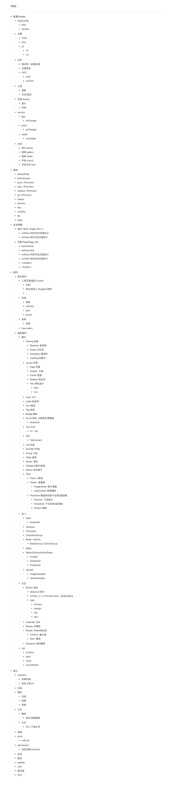

# Project App

> outline

# core: 如何设计一个React Native路由

## #0 what's your problem ?

> 厚葬友军

- [all-about-routing](https://tech.glowing.com/cn/all-about-routing-and-navigation-in-react-native/)

> 站在巨人的肩膀上

- 小程序
  - Page
  - Component

- vue-router
  - beforeHooks

- 弹出层的一些想法

- 预期能力
  - core
    - 生命周期
    - 钩子
    - 静态路由表与动态路由 <动态页面预警>
    - 页面传参
    - URLSchema 解析
  - feeling
    - 动画
    - 返回键/手势
  - devloper
    - redux free
    - event
    - debug
    - Exception

## #1 生命周期与钩子
> AOP yes!

- onShow
  - history.push   //  路由入栈新页面, 触发栈顶页面 onShow
  - onAppActive    //  App 返回前台, 触发栈顶页面 onShow

- onHide
  - history.pop    //  栈顶出栈, 触发栈顶 onHide
  - hisotry.push   //  栈顶有新页面入栈, 触发原栈顶页面 onHide
  - onAppDeActive  //  App 进入后台, 触发栈顶页面 onHide

- Thinking: 组件如何使用所在页面的钩子？

  - Magic! [React.createContext](https://react.docschina.org/docs/context.html#reactcreatecontext)
  - 附加题: Tab 组件的设计

- beforeEnter 入场钩子

- beforeLeave 离场钩子

## #2 数据结构与Api的初步设计
> 这个需求很简单, 怎么实现我不管

- 数据结构
  - history: Route[]
  - route: Nav[]
  - nav: Page | Layer

- hooks 全局钩子
  - onShow: (page: Page) => void
  - onHide: (page: Page) => void
  - beforeEnter: (page: Page) => Promise<any>
  - beforeLeave: (page: Page) => Promise<any>

- actions
  - push: () => void
  - pop: () => void
  - replace: () => void
  - go: () => void
    - history.has ? pop until find : push
  - popup: () => void 弹窗
  - dismiss: () => boolean 取消弹窗

- db 数据/页面传参

- trace 痕迹

- URLSchema
  - across()

## #3 基本动作的实现
> 基本操作, 基本操作

- push
  - `hisotry.push([next])`
- pop
  - `hisotry.pop()`
- replace
  - `hisotry[hisotry.length - 1] = [next]`
- go
  - `this.push`
  - `while (topNav[0] !== target) hisotry.pop();`
- popup
  - `topNav.push(Layer)`
- dismiss
  - `topNav.pop()`

## #4 核心组件与渲染
> redux free!

- Root
  - `router.event`
- Page
  - `position: absolute`
  - @beforeEnter
  - @beforeLeave
  - @onShow
  - @onHide
  - @render
- Layer
  - `position: absolute`

## #5 页面传参与配置
> power of immmer

- when
  - `push(page, data, config)`
  - `replace(page, data, config)`

- where
  - router.db [location.query,location.search]
    - 问题: 全局变量
    - 优势: 在组件中方便的使用
  - pageInstace.props.routeDB
    - 问题: 组件中如何使用
    - 优势: 伴随组件生命周期
  - keep? [Cookie]

- clear?
  - immer.applyPatches

## #6 生命周期的实现
> @ref, @AppState

- Page.onShow/Page.onHide
  - @componentDidMount onShow
  - @componentWillUnmount onHide
  - AppState.onChange
    - ref.onShow / ref.onHide

- 组件内如何使用所在页面钩子?

  - const { Provider, Consumer  } = createContext({});
  - <Page>.lifetimes = { onShow: [], onHide: [] }
  - <Page>.render <Provider>
  - <Life> <Consumer>
    - props: onShow
    - props: onHide

- 主要问题
  - 进入动画未完成, 页面还未进入, 触发了 onShow
  - beforeEnter 权限校验未通过, 还是进入了页面触发了 onShow

## #7 Promise, 钩子和动画
> Promise yes!

- All in Promise
  - push: () => Promise<any>
  - pop: () => Promise<any>
  - replace: () => Promise<any>
  - go: () => Promise<any>

- push: Promise
  - 创建路由信息 next
    - id
    - name
    - element
    - ref
    - ...
  - 先假装push并渲染, history.push([next]);
  - db.push(data);
  - forceUpdate render // 通过 transform 来隐藏
  - [等待 ref 完成], 拿到实例, 主要是为了实例上的 beforeEnter 钩子
  - Promise.all beforeEnter 钩子
    - then
      - 触发入场动画
      - 触发 length - 2 页面的 onHide
      - 触发 next 的 onShow
      - resolve
    - catch
      - db.revert();
      - hisotry.pop();
      - reject

- pop: Promise
  - 获取栈顶实例
  - Promise.all beforeLeave 离场钩子
    - then
      - 触发栈顶动画
      - [等待动画完成]
      - 触发当前 onHide
      - db.push(data)
      - hisotry.pop();
      - 触发下一个页面的 onShow
      - reoslve
    - catch
      reject

- go: Promise
  - `while (topNav[0] !== target) hisotry.pop();`
  - 如果所有钩子都执行, 可能被中间页面中断, 另外批量触发pop动画也会卡顿,
    所以只对栈顶页面进行 pop 判断和动画, 中间页面直接 splice 掉

## #8 Backhandler与手势
> Native

- 触发 pop / dismiss
- 手势是个大难题

## #9 URLSchema
> push 与 linking

- parser 解析 URL 参数
- polyfill pop
  - 如果栈底不是 /, 则替换为 /, 不用push是因为那样就成死循环了
- across(paths) 追加穿透行为
  - 根据给定路由记录制造路由栈
  - 最后一个页面需要动画, 其余不需要, 跟 go 的一种情况是反向操作
- 另一个难题across 中途被 Auth 之类的终端了, 再怎么续上
  - 保留 unacross, 然后 across 方法就递归

## #10 原子操作页面的一个小礼物
> atom

- 原子操作页面
  - 选择联系人
  - 选择地址
  - 扫码
  - ...

- wait
  - push 表现一样, 只是 resolve 会被存储, 等待回到栈顶接收参数
  - `wait('/next').then(got => console.log('got it', got));`

## #11 debug 与 Exception
> 面向 console.log debug

- trace page 需要追加的信息, 用于debug 和 log
  - lifetimes: []
  - name
  - path

- enum Exception
  - AOP 尽量给出位置信息方便 debug
